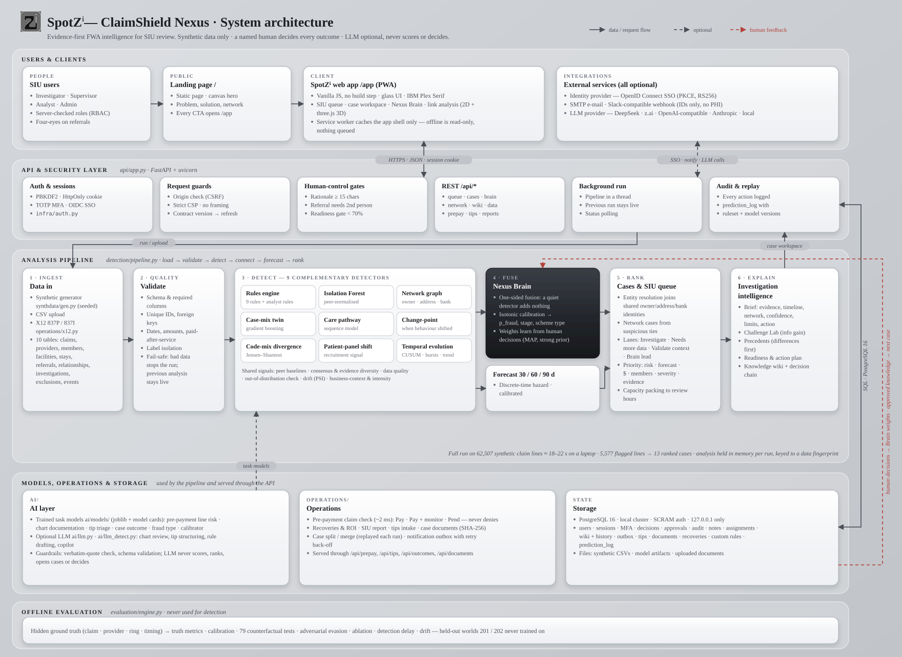
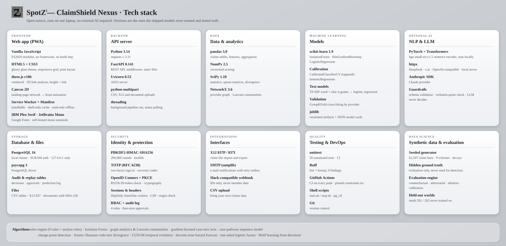

# SpotZⁱ — ClaimShield Nexus

The working responsive web application is in [`spotzi/`](spotzi/README.md). Start it with `cd spotzi && pip install -r requirements.txt && ./start.sh` and open http://localhost:8000. It is installable as a PWA and keeps workflow data server-authoritative.

Design blueprint: [`idea/`](idea/README.md), including Precedent Intelligence for faster human review.

## What's new in this version
- **Forecast checked against a simple baseline.** The 30/60/90-day forecast is compared with "recently flagged = risky" on a later, untouched time window, with 95% confidence intervals, precision at investigator capacity and a separate new-onset result. It scores higher (30-day AUC 0.955 vs 0.933), but the gain is not statistically proven and new-onset prediction is weak; we say so in the app (*Governance → Forecast vs recent-flag baseline*).
- **Tamper-evident audit chain.** Every audit entry is sealed into a SHA-256 hash chain; *Governance → Verify now* names any altered, deleted or inserted entry. `python3 -m scripts.audit_tamper_demo` shows a live edit being caught, then rolls it back.
- **Hashed investigation policy.** Rules, priority weights and gates are hashed into a policy version recorded on every audit entry and decision.
- **Refused actions logged.** A user without the right role (e.g. an analyst trying to decide a case) is blocked and the attempt is recorded.
- **Results by provider type.** All 8 provider types: every fraudulent provider caught, no false positives; the weakest ranking is DME (AUC 0.82–0.97).
- **Team accounts.** Accounts come from `spotzi/data/seed_users.json`; `python3 -m scripts.sync_users` loads changes. Passwords need at least 8 characters.
- **55 automated tests**, lint and format checks, CI on every push.

## Documentation
| Document | What it covers |
|---|---|
| [`SPOTZI_PRODUCT.md`](SPOTZI_PRODUCT.md) | Every feature, roles, responsible AI, architecture |
| [`EVALUATION.md`](EVALUATION.md) | All measured results, including forecast vs baseline, results by provider type and governance tests |
| [`spotzi/README.md`](spotzi/README.md) | How to run, project layout, common commands |
| [`DEMO.md`](DEMO.md) | Presenter notes |
| [`docs/SpotZi-Demo-Guide.pdf`](docs/SpotZi-Demo-Guide.pdf) | 5-minute demo, click by click, with screenshots |
| [`docs/SpotZi-ClaimShield-Nexus.pptx`](docs/SpotZi-ClaimShield-Nexus.pptx) | Pitch deck (6 content slides) |
| [`docs/SpotZi-ClaimShield-Nexus-Solution-Report.pdf`](docs/SpotZi-ClaimShield-Nexus-Solution-Report.pdf) | Full solution report |

