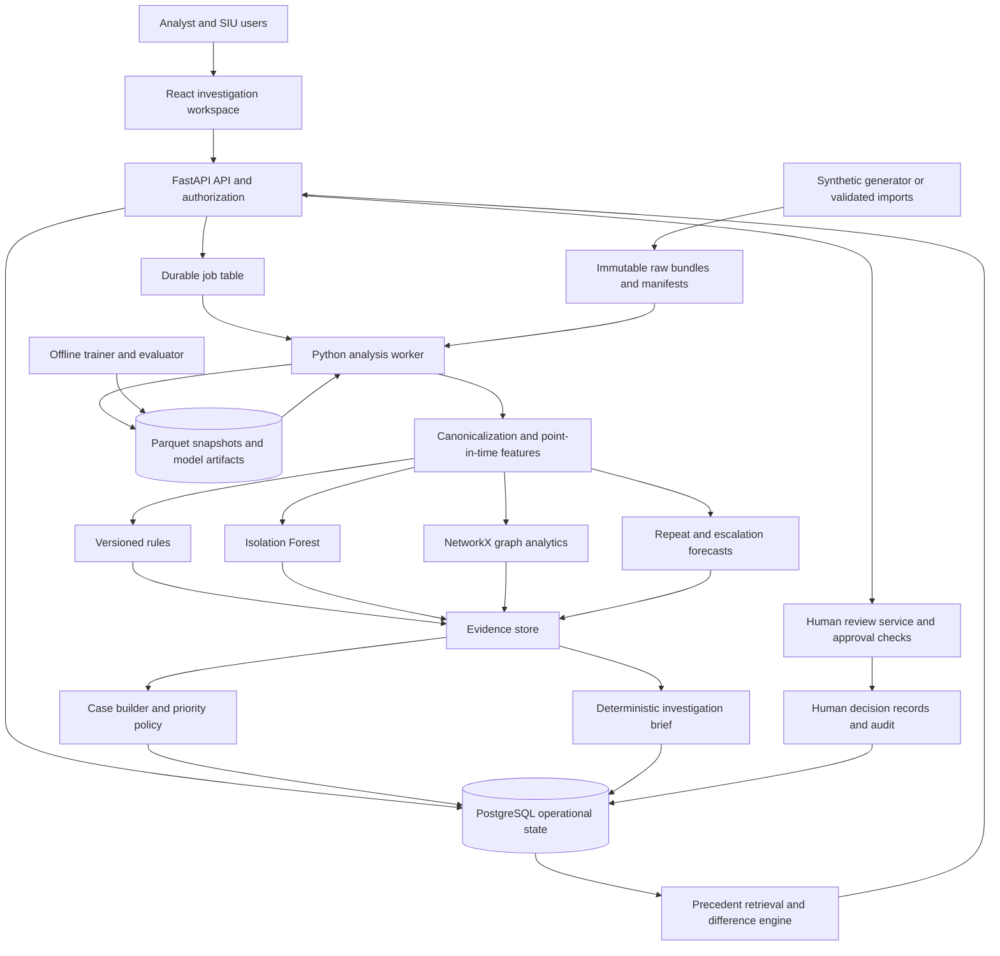

# 03 — System architecture

## Recommended deployment shape

Use a modular monolith: a React web client, one Python API, one worker process, and PostgreSQL. The API and worker import the same domain packages. This gives clear boundaries without building a distributed platform before there is a working investigation flow.

Hidden simulation truth lives in a separate evaluation-only directory and is not mounted in the API or scoring worker. Training uses a dedicated label-building step; serving artifacts contain no truth tables.

## Component responsibilities

| Component | Owns | Must not own |
|---|---|---|
| Web | Display, filters, case interactions, accessibility | Risk formulas, authorization decisions |
| API | Request validation, RBAC, transactions, job submission | Long training or graph jobs in request threads |
| Ingestion | Schema checks, manifests, quarantine, immutable raw rows | Silently repairing ambiguous identities |
| Canonicalizer | Claim lineage, as-of state, reversals, normalized units | Erasing history or replacing uncertainty with zero |
| Feature builder | Point-in-time aggregates and comparator definitions | Future data, hidden truth, outcome leakage |
| Detectors | Rule, anomaly, temporal and graph signals | Case decisions or payment actions |
| Forecaster | Validated future-event probabilities and eligibility | Invented probabilities on unsupported inputs |
| Case service | De-duplication, evidence grouping, lifecycle | Treating all connected providers as culpable |
| Priority service | Transparent policy and capacity recommendations | Unreviewed automatic adverse actions |
| Brief service | Citation-backed narrative and tables | New unsupported facts |
| Human review service | Authenticated proposals, approvals, disagreements, decision audit | Allowing workers/models to impersonate a decision maker |
| Precedent service | Eligible historical snapshots, similarity, material differences, review blueprints | Applying an old outcome to a current case |

Enforce a separate authorization boundary between analysis recommendations and human decisions. Workers can write findings and candidate recommendations; only authenticated human roles can write decision proposals/approvals through the review service. All input entity records are synthetic; public real-provider or patient datasets are excluded.

## Technology choices

React/TypeScript supports a rich workbench; Vite keeps the frontend build straightforward. TanStack Query handles server data and cache invalidation; TanStack Table supports dense queues. Cytoscape.js is a proposed graph renderer; Recharts handles time series and distributions. Verify versions and licenses when implementing.

Ship the frontend as an installable PWA. Cache only the versioned application shell; keep API responses, evidence, and decisions server-authoritative. Offline mode is explicitly read-only. PostgreSQL performs the first precedent search using typed filters and explainable structured similarity. Add `pgvector` only after structured retrieval has a measured baseline and reviewed embedding inputs.

FastAPI/Pydantic define typed endpoints; SQLAlchemy/Alembic provide database access and migrations. PostgreSQL stores tenants, datasets, cases, evidence, jobs, and audit events. JSONB is useful for detector-specific details, but primary identifiers, dates, money, statuses, and relationships remain typed columns.

Use DuckDB SQL over Parquet for reproducible feature joins and Polars for generator/preparation code where it is clearer. Keep one canonical feature implementation; do not maintain equivalent pandas, SQL, and web formulas. NetworkX is adequate for bounded prototype graphs. A graph database is an optional later read projection, not a prerequisite.

## Analysis run contract

Every run fixes `tenant_id`, `dataset_version`, `as_of`, `ruleset_version`, `feature_version`, `model_bundle_version`, `graph_version`, and `priority_policy_version`. A run reads a consistent input snapshot and produces immutable outputs. Human case activity is mutable through versioned transactions and links to snapshots.

Stages write to run-scoped staging tables/artifacts. The worker validates counts and manifests before atomically promoting a completed run. Partial results can be explicitly inspected but never masquerade as a fully completed run. Retrying a stage uses an idempotency key and upserts deterministic outputs for that stage attempt.

## Point-in-time semantics

Record event time and knowledge time. At cutoff `t`, use only information available by `t`; a backdated claim received tomorrow is unavailable today. A reversal received later changes a later snapshot, not the historical paid state. The same rule applies to ownership changes, referrals, investigations, and corrected dimensions.

Use UTC instants plus source timezone and timestamp precision. A service date without a time cannot support minute-level timing conclusions. Never use the scoring machine's current date as the implicit historical cutoff.

## Failure isolation

If anomaly scoring fails, retain completed rule outputs with a partial status. If the forecast model is incompatible with the feature version, fail that component closed and show unavailable. If graph extraction exceeds limits, report truncated coverage and avoid network-level conclusions requiring missing edges. If an optional language model fails, render the template.

Job leases expire after a configurable heartbeat timeout; retries are bounded and recorded. A database transaction promotes results and emits an audit event together. A worker crash before promotion must not create half-assigned cases.

## Scale path

Baseline fixture: 100,000 claim lines, 5,000 synthetic members, 500 providers, 24 months. Large evaluation fixture: up to one million lines, generated separately. These are planned workloads, not measured capacity.

At larger scale, partition claim facts by tenant and service month, materialize daily aggregates, update changed provider windows, and restrict graph extraction to relevant subgraphs. Measure before introducing Redis/Celery, object storage, a warehouse, Neo4j, or Kubernetes. Kafka, GNN infrastructure, and multi-cloud deployment are unnecessary for the first release.

The domain goal involves millions of claims; a laptop demo does not prove that scale. Publish the actual benchmark hardware, data volume, runtime, and peak memory in the evaluation report.
