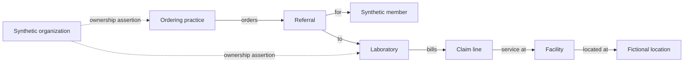

# 11 — Graph and network intelligence

## Two graphs, two purposes

Maintain a **typed evidence graph** for explanation and a **filtered provider projection** for analytics. Do not run community detection on every raw node type indiscriminately: high-degree members, hospitals, and locations can dominate the result.

| Node | Example | Meaning |
|---|---|---|
| Provider | SYN-PROV-0042 | Fictional rendering/ordering/billing entity |
| Member | SYN-MEM-1021 | Fictional beneficiary, never presumed culpable |
| Facility | SYN-FAC-008 | Service setting |
| Location | SYN-LOC-019 | Fictional site with precision metadata |
| Organization/owner | SYN-ORG-003 | Simulated affiliation or ownership assertion |
| Claim/line | SYN-CLM-780/2 | Source billing event |
| Referral | SYN-REF-018 | Dated ordering relationship |
| Investigation | SYN-INV-007 | Historical outcome available as of cutoff |

Edges include `BILLED`, `RENDERED`, `RECEIVED_SERVICE`, `OCCURRED_AT`, `LOCATED_AT`, `ORDERED`, `REFERRED_TO`, `AFFILIATED_WITH`, `OWNERSHIP_ASSERTION`, and `SUBJECT_OF_REVIEW`.

Every edge stores source rows, relationship type, validity interval, availability time, confidence, and run version. Dashed edges denote unresolved assertions. A common address supports co-location, not ownership. Keep identity resolution, affiliation, and ownership as separate concepts.

## Example evidence path



The useful story is the conjunction of concentrated referrals, repeated billings, independent timing evidence, and a supported relationship. The graph must make clear which connections are facts, which are assertions, and which patterns are inferences.

## Build the analytics projection

For each cutoff, aggregate referrals and shared service populations over a specified 90-day window. Add provider-to-provider edges for observed directed referrals and separately retained relationship indicators. Keep edge components inspectable.

Example undirected community weight, a demo assumption:

```text
w(a,b) = 0.5 * normalized_referral_strength
       + 0.3 * supported_member_overlap
       + 0.2 * documented_affiliation_strength
```

Require minimum support, down-weight ubiquitous hubs, and avoid using raw claim count alone. Same-location edges appear in the evidence graph but do not create analytical links by themselves. Run sensitivity checks with affiliation removed so a legitimate corporate network does not dominate scoring.

## Analytics to implement

1. **Referral concentration:** recipient shares and a concentration index, compared within supported specialty/setting cohorts.
2. **Shared-member overlap:** Jaccard similarity with minimum counts; large institutions get appropriate controls.
3. **Communities:** use NetworkX Louvain on the weighted provider projection as a candidate grouping technique, with a fixed seed and recorded resolution. Louvain seeks modularity-based communities; it does not identify criminal networks. [NetworkX Louvain documentation](https://networkx.org/documentation/stable/reference/algorithms/generated/networkx.algorithms.community.louvain.louvain_communities.html).
4. **Motifs:** small explainable structures such as ordering practice → laboratory → repeated-member claims, linked with an ownership assertion and independent billing evidence.
5. **Temporal change:** compare motif intensity and referral concentration against prior as-of windows, avoiding future edges.

Degree and centrality can describe a network but are not inherently suspicious. A well-connected hospital should not receive a high-risk label merely because of its size.

## From community to candidate case

A community is not automatically a case. Require at least one substantive billing/service finding and a supported relationship that explains why evidence should be reviewed together. Additional independent signals increase support; a graph connection alone produces context, not an allegation.

Auto-grouping creates a **candidate grouping**. An investigator accepts, splits, or merges it before adopting it as the investigation scope. Retain the algorithm proposal and human revision. Do not propagate guilt from a suspicious provider to every member or referral partner.

## Graph API and UI limits

Default to a selected case's two-hop neighborhood with explicit limits, such as 100 nodes and 300 edges for initial rendering. Fetch additional paths on demand. Return total eligible counts and `truncated: true` when limits apply. Never truncate silently.

Clicking an edge opens its source, validity, availability, confidence, and underlying records. Filters cover relationship type, date, confidence, family, and evidence status. Provide a relationship table and exportable edge list so evidence is accessible without navigating a canvas.

## Validation

Test genuine synthetic referral networks against equally connected legitimate groups. Measure candidate-network precision, involved-provider recall, bystander inclusion, community stability across seeds, and incremental case yield over rules/anomalies alone.

Rebuild historical projections at each forecast anchor. A later ownership assertion must not appear in an earlier graph. Detecting planted topology is easier than discovering real coordination; report this limitation and hold out alternate network shapes.
