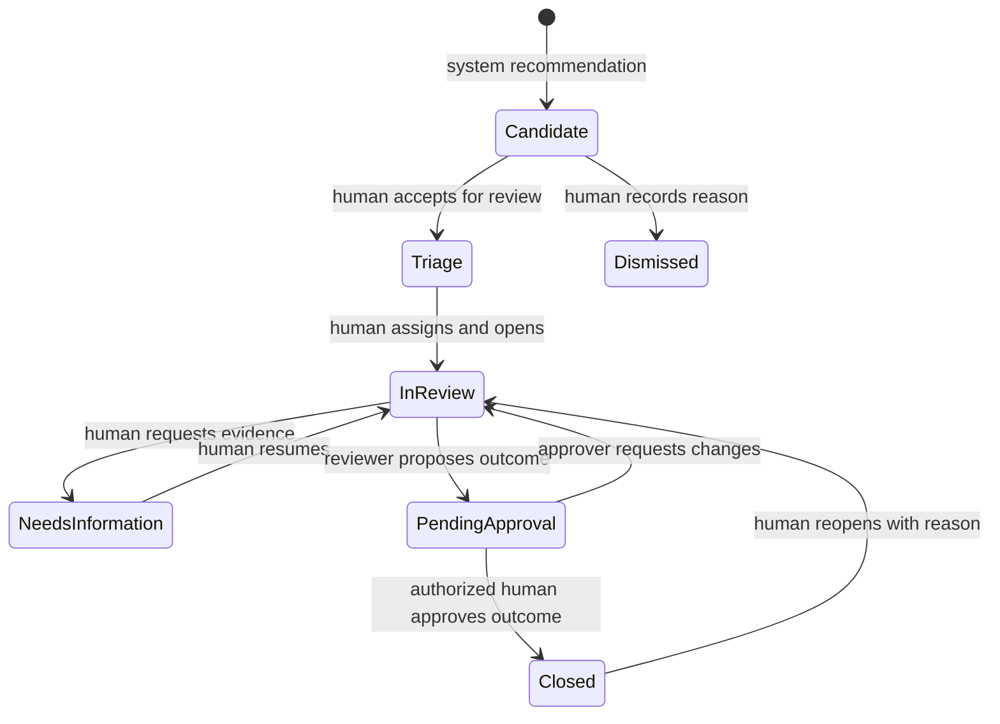

# 12 — SIU prioritization, capacity, and case lifecycle

## Separate signals, candidates, and investigations

A finding is a detector output. A candidate case groups related findings. An investigation is a scope that a human reviewer has accepted. The system may propose grouping, ranking, and assignment; people decide whether to open, assign, merge, split, escalate, or close investigations.

## Candidate construction

1. De-duplicate exact findings using detector version, subject, source set, and window.
2. Group overlapping findings by primary provider, compatible scenario family, and episode/window.
3. Propose network grouping only where substantive findings and supported relationships coexist.
4. Separate members affected by the activity from providers suspected of responsibility.
5. Associate a candidate with an existing open case when evidence genuinely continues that case; show the proposed association for review.
6. Preserve a stable case ID with immutable analysis snapshots and explicit human scope revisions.

Do not group all alerts into one giant connected component. Different clinical service families or unrelated episodes can share a billing organization while needing separate review.

## Current-risk index

Use a transparent heuristic until enough validated labels exist to justify a supervised current-risk model:

```text
current_risk_index = 100 * (0.40 R + 0.25 A + 0.20 G + 0.15 T)
```

Each component is in `[0,1]`: R = strongest supported rule-family evidence with capped independent corroboration; A = provider anomaly reference percentile; G = supported network-pattern strength; T = temporal persistence/escalation indicator. Document exact mappings in `priority_policy.yaml`.

This index is not a probability. Repeated correlated rule hits do not count as independent corroboration. If a component is unsupported, return the index as unavailable or an explicitly partial index with its coverage; the default queue uses a declared fallback policy. Never silently assign missing components zero or renormalize them into false certainty.

## Dollars and member impact

Maintain three distinct quantities:

- **Gross implicated paid exposure:** distinct canonical implicated lines' positive net paid amounts. It is a review scope, not proven loss.
- **Potential excess estimate:** only where a defensible calculation exists, such as extra equivalent paid duplicates after one retained service. Otherwise null.
- **Confirmed/realized amount:** human-entered simulated outcome, separately referenced. Never inferred from the risk score.

Overlapping rules and cases cannot multiply dollar totals. Store line-level attribution; portfolio totals use a set union or a reviewed primary attribution. Unpaid claims show potential billed/allowed exposure separately from paid dollars. Never sum these together as “savings.”

Member impact includes distinct affected members and a separately evidenced severity assessment. High utilization or membership in a network does not imply the member is responsible. Clinical harm is unknown unless supported by a synthetic event or human review; financial patterns alone cannot establish it.

## Ranking policy

For complete eligible cases, an initial transparent policy is:

```text
priority = 100 * (0.30 risk + 0.20 dollars + 0.15 member_impact
                + 0.15 severity + 0.10 evidence_quality + 0.10 future_risk)
```

Here all inputs are normalized to `[0,1]`. `future_risk` uses the selected horizon and a named endpoint, default repeat; escalation remains separately displayed. Do not add endpoint probabilities. `dollars = min(log1p(exposure_usd)/log1p(50000),1)` is a proposed demo scale. Member count uses an analogous capped scale, supplemented by human-reviewed severity. Evidence quality combines source coverage, specificity, and independent corroboration, without pretending to be statistical confidence.

For cases without a valid forecast, use a separately versioned policy: 0.35 risk, 0.20 dollars, 0.15 member impact, 0.15 severity, 0.15 evidence quality. Show which policy was used. Cases lacking meaningful current-risk coverage go to a data-quality review lane instead of receiving a deceptively low score. Compare ranking behavior across policy variants in evaluation.

These weights are initial assumptions. Have the SIU manager review them and sensitivity-test before adopting them. Display component contributions, not only a final number. Allow manual priority overrides with reason, actor, expiry, and preservation of the computed recommendation.

## Capacity mechanism

Input: team hours for a named week, reviewer skills, work-in-progress limits, case hour estimates, and any human-designated urgent cases. The system produces a preview maximizing approximate priority utility under the hours constraint.

Start with transparent greedy selection by priority per estimated review hour, subject to minimum evidence and skill constraints. Show that this is a heuristic, not an optimal guarantee. For small sets, an integer knapsack/assignment solver is a later enhancement. Recompute portfolio dollar totals over unique lines for every proposed selection.

Managers approve assignments explicitly. A high-severity signal is surfaced for urgent human triage, not automatically escalated externally. Aging cases remain visible through a separate overdue filter and scheduled human review; a low-dollar case must not disappear indefinitely.

Hour estimates are configurable placeholders initially, such as two hours for focused duplicates and eight for a multi-provider network. Replace them only after enough actual review-duration data exists. Record estimate revisions and avoid rewarding artificially cheap estimates.

## State machine



Outcome is separate from status: `not_supported`, `inconclusive`, `substantiated_simulation`, `education_opportunity`, or `referred_for_further_human_review`. No external action is executed. A new model run can add a recommendation but cannot overturn a human outcome silently.

Feedback becomes training input only through a reviewed label-curation process. Store who reviewed what, evidence available at the time, whether the case was selected by the model, and label uncertainty to support analysis of selection bias.
