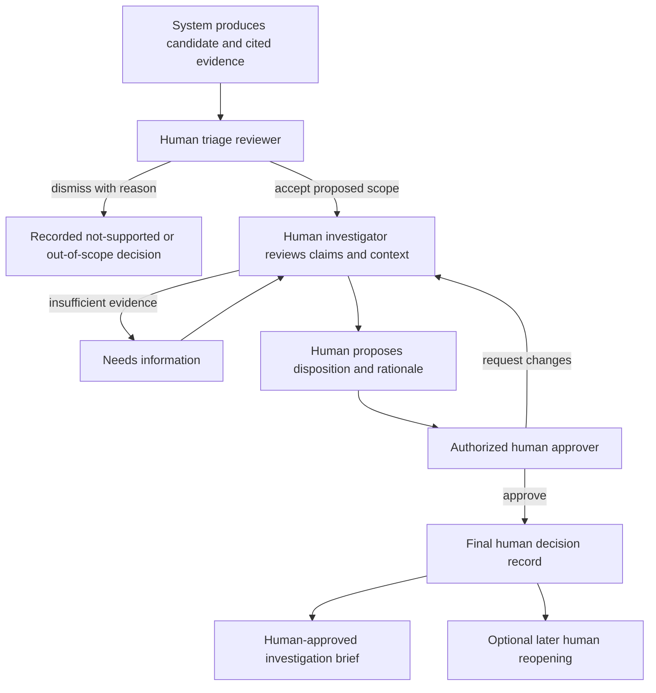

# 20 — Human review and final decision mechanism

## Mandatory principle

**The system recommends; a human decides.** No risk score, rule, graph pattern, forecast, or language-model response can substantiate a case, approve an investigation outcome, deny a claim, suspend payment, sanction a provider, contact a member, or initiate an external referral.

All records used in this mechanism are synthetic. The demo still exercises a realistic approval process with fictional reviewer accounts. This requirement is part of the product architecture, not a sentence appended to a report.

## Recommendation and decision are separate records

`recommendations` contain detector/model outputs, proposed case scope, priority, suggested review steps, and supporting evidence. The analysis worker writes these.

`decision_proposals` contain an investigator's interpretation, proposed disposition, reviewed case version, reviewed evidence IDs, unresolved limitations, and reason. Only an authenticated human investigator can submit one.

`human_decisions` contain the approver identity/role, approved or rejected proposal, final outcome, rationale, evidence references, timestamp, and case version. Only authorized human roles can write these through the decision service. A service identity is rejected even if it can write analysis outputs.

This separation prevents a field such as `risk=high` from being treated as `fraud=confirmed` in downstream code.

## Review sequence



For a small demo, one person can operate multiple fictional roles to demonstrate the mechanism. The interface must visibly show the role change. Where policy requires two distinct approvers, enforce distinct account IDs; do not claim independent review if the same real operator performed both roles in a demonstration.

## Review rubric

Before submitting a decision, the investigator answers:

1. Which specific claims and source fields support the concern?
2. Have replacements, reversals, distinct encounters, and applicable exceptions been checked?
3. Which relationships are documented and which remain inferred or asserted?
4. Could legitimate care complexity, capacity changes, or missing data explain the pattern?
5. What information is missing, and does that prevent a conclusion?
6. What is the appropriate next human action, considering both member and provider impact?
7. If precedents were used, which material differences were reviewed and why is the reused checklist applicable here?

These are persisted structured fields plus a concise narrative, not a checkbox asserting that the model is correct. Evidence review acknowledgments record what was available and inspected; they do not prove that a person understood it.

## Dispositions and approval levels

| Outcome/action | Who proposes | Who decides | Required record |
|---|---|---|---|
| Accept/dismiss candidate | Triage investigator | Authorized investigator | Reason, evidence, scope |
| Assign investigation | System may recommend | SIU manager | Reviewer, skills/capacity, reason |
| Request more information | Assigned investigator | Assigned investigator | Specific missing evidence, due date |
| Not supported/inconclusive | Assigned investigator | Authorized approver per policy | Alternatives considered and supporting references |
| Substantiated in simulation | Assigned investigator | Distinct SIU approver by default | Corroborating evidence and resolved material exceptions |
| Refer for further internal review | Assigned investigator | SIU manager | Recipient role and reason; no external message sent |
| Merge/split scope | Investigator or system proposal | Case owner/manager | Included/excluded entities and evidence |
| Reopen | Authorized investigator | Manager where policy requires | New evidence or identified decision error |
| Approve brief | Investigator | Authorized reviewer | Exact brief/evidence version |

No minimum model score authorizes a final decision. A reviewer may disagree with the system, and the UI must make disagreement easy to record. A low-risk recommendation does not block opening a case when human evidence justifies it.

## Decision schema

```text
decision_id
tenant_id
case_id
case_version_reviewed
proposal_id
decision_type
outcome
reason
evidence_ids[]
exceptions_considered[]
unresolved_questions[]
actor_id
actor_role
approver_id
decided_at
prior_decision_id?       # Reopening/amendment lineage
idempotency_key
```

Actor and role come from server authentication. The API rejects self-approval where the policy requires separation, stale case versions, unrelated evidence IDs, empty rationale, or unsupported outcome transitions. Decision and audit writes are one transaction.

## Human review UI

Keep **Recommendation** and **Human decision** panels visibly separate. The recommendation panel displays sources, uncertainty, and alternatives. The decision form has no preselected “substantiated” value and cannot be submitted by merely accepting a score.

Present “Request information,” “Propose outcome,” and “Record disagreement” as first-class actions. Before approval, show the precise scope, dollar interpretation, unresolved questions, and irreversible consequences—although this prototype performs no external adverse actions.

Include a “What changed since I reviewed?” view. If new evidence arrives, the system can flag a review need; it cannot silently modify the approved decision. An approver can return a proposal with a reason, creating a visible disagreement and revision trail.

The decision view may link to a frozen precedent retrieval and review blueprint. It must not preselect the outcome or copy precedent reasoning into the rationale. The reviewer writes current-case reasoning and cites current-case evidence; precedent citations explain process context only.

## Feedback and model learning

Do not retrain directly after each click. Review decisions may be incomplete, inconsistent, or selected by existing model priorities. A human label curator groups outcomes, checks evidence, resolves disagreement, records selection mechanisms, and creates a versioned training-label release.

Keep generator truth, simulated historical decisions, and live-demo reviewer decisions separate. Evaluate how often the system and humans differ, but do not score all disagreement as human error. Include a reviewed random sample of lower-ranked synthetic cases to assess missed patterns and selection effects.

## Acceptance tests

- Scoring a dataset creates recommendations and zero final human decisions.
- A worker/service identity cannot call final-decision or approval endpoints.
- A high score cannot bypass required evidence review or approval roles.
- Missing evidence permits an inconclusive decision and request for information.
- Reviewer disagreement is retained, not overwritten by a rerun.
- Two concurrent decisions cannot both overwrite the same case version.
- Approving a case records the human actor, rationale, evidence, and exact snapshot.
- An approved brief remains unchanged when a new model run occurs.
- All payment, sanction, and external-contact capabilities are absent from the prototype.
- All demo sources and review personas remain synthetic.

The strongest demonstration ends with a reasoned human decision and its audit trail, not with an automated “fraud detected” banner.
