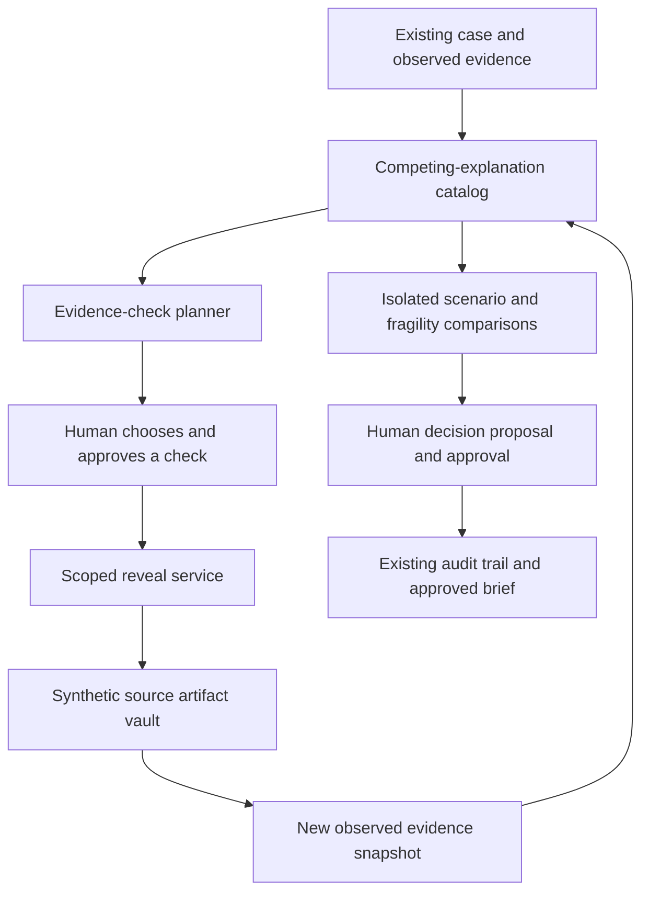

# 21 — Flagship add-on: SpotZ^i Evidence Challenge Lab

> Proposed feature, not implemented. Synthetic records only. Every investigation decision remains human. Competitive observations reflect a targeted public-source review on 8 October 2026, not an exhaustive market or patent search.

## The recommendation

Build an investigation workspace that answers:

**“What else could explain this pattern, what evidence would distinguish those explanations, and what should a human inspect next?”**

The flagship interaction is **Challenge this case**. It opens competing explanations, the evidence supporting and contradicting each, a recommended next evidence check, and isolated scenario branches. An investigator chooses which check to perform, reviews the result, and makes the decision.

This extends SpotZ^i from detecting patterns to helping investigators resolve uncertainty efficiently and defend their reasoning. Its most memorable demonstration is two cases with identical visible claims but different underlying explanations, revealed through investigator-approved evidence checks.

## What is and is not a credible uniqueness claim

Graph analytics, explainable alerts, summaries, human oversight, and next-best actions already have public precedents. SAS describes hybrid payment-integrity analytics; Shift describes investigation planning and next-best actions. Graph-based healthcare FWA analysis also has a substantial research history. [SAS payment integrity](https://www.sas.com/content/dam/SAS/en_us/doc/solutionbrief/payment-integrity-108557.pdf), [Shift Fraud & Risk](https://www.shift-technology.com/en-gb/solutions/fraud-risk), [AAAI healthcare graph analysis](https://ojs.aaai.org/index.php/AAAI/article/view/19047).

Simulation is not novel by itself either; Quantexa publicly discusses simulation with contextual decision intelligence. [Quantexa simulation discussion](https://www.quantexa.com/blog/building-better-decisions-through-simulation-and-context/).

The proposed differentiation is the tightly integrated experience: competing legitimate and suspicious explanations, evidence selection under a review budget, explicit inability to distinguish explanations from current data, branch comparison, and an auditable human decision. This is a product-design recommendation and a hypothesis to validate with users. Public pages do not establish whether another vendor offers the same complete workflow privately. Do not market it as the world's first or guaranteed unique.

## One feature with five connected capabilities

### 1. Competing-explanation board

For each finding, show plausible alternatives. For repeated laboratory billing:

| Explanation | Supporting observations | Evidence needed to distinguish it |
|---|---|---|
| Legitimate repeated monitoring | Separate dates and supported simulated monitoring context | Distinct orders/specimens/encounters |
| Administrative duplication | Matching submissions with adjustment indicators | Replacement lineage and payment reversals |
| Potentially unsupported repeat billing | Repeated charges without distinct-service support | Complete source records and relevant exceptions |
| Data incompleteness or another explanation | Feed gaps or inconsistent identifiers | Coverage reconciliation or additional human investigation |

These explanations can coexist across different lines in one case. Do not force a whole provider into one exclusive category. Start with line/episode-level explanation sets and let the investigator split the case.

Every item is labeled as an observed fact, hypothesis, contradiction, or missing prerequisite. A language model may reword catalog explanations, but it cannot invent source facts or assign legal intent.

### 2. Next evidence check

The system recommends a check that could resolve a material ambiguity, with estimated review effort and an explanation of its value. Examples include reconciling a reversal, inspecting separate specimen records, checking whether a session was group or individual, and verifying an ownership assertion.

The recommendation must address both confirming and disconfirming evidence. “Look for more suspicious claims” is not an adequate default. A check that can clear a legitimate provider is valuable.

The human selects and approves the check. In this prototype it reveals only an authorized, previously generated synthetic artifact. No external record request, member contact, or provider outreach occurs.

### 3. Scenario branches

Before acquiring evidence, show conditional branches:

- If a valid full reversal is found, the duplicate paid-exposure calculation may decrease.
- If distinct services are documented, those lines may no longer support the duplicate hypothesis.
- If the relevant feed is incomplete, missing records remain inconclusive.
- If complete records contradict billed events, the investigator may decide that further review is warranted.

A branch is a hypothetical analysis workspace, visibly separate from observed evidence. It cannot overwrite source rows, approved decisions, or the baseline brief. If the user subsequently observes matching evidence, create a new observed case snapshot through the normal workflow.

Calling this a scenario branch does not establish a causal model. A change in score after replacing an input is model sensitivity, not proof that an intervention would prevent fraud or save money.

### 4. Evidence fragility view

Show which conclusions depend on unresolved assumptions or a single source. Example: “The network concern relies on an unverified ownership assertion; repeated paid lines remain independently supported.”

Recompute supported findings under allowed assumption removals, such as excluding an uncertain ownership edge. Preserve the reason for the test. Do not let users erase inconvenient verified facts and then label the result an exoneration.

Report statements such as “supported under 4 of 6 configured checks,” with the checks listed. This is a robustness summary over chosen tests, not a probability or guarantee. If no permitted test can assess an assumption, say so.

### 5. Human decision replay

When the reviewer decides, retain the initial recommendation, alternatives considered, evidence checks proposed and chosen, results revealed, branch comparisons, remaining uncertainty, and final human reasoning.

A later reviewer can reconstruct why a person dismissed, narrowed, expanded, or kept a case inconclusive. An approved decision is never automatically rewritten because new evidence or a different model changes the recommendation.

## The signature demonstration: identical claims, different explanations

Create a matched pair of synthetic cases with equivalent initial claim, payment, and graph features. Use randomized identities and exclude scenario metadata so the engine cannot distinguish the pair by a shortcut.

**Case A:** the repeated service lines correspond to distinct legitimate encounters documented in the initially unexposed synthetic evidence vault.

**Case B:** the initially unexposed, coverage-complete synthetic records contradict the claimed distinct encounters and support further review. This still does not by itself establish fraudulent intent.

Walk through the following sequence:

1. Both cases initially receive the same evidence status and recommendation for the relevant pattern.
2. The system explicitly states that currently visible claims cannot distinguish the explanations.
3. It recommends checking the relevant encounter/specimen evidence and explains what each result would mean.
4. The human approves the check for each case.
5. Fixed synthetic source artifacts are revealed; the software does not generate a convenient answer on demand.
6. In Case A, the investigator accepts the legitimate explanation for those lines and records a reasoned disposition.
7. In Case B, the investigator decides whether to request more evidence or propose further internal review.
8. Both decisions and their supporting evidence remain auditable.

The demonstration succeeds because the system knows what the current data cannot tell it, identifies useful additional evidence, and helps a person avoid an unsupported conclusion.

## Synthetic evidence vault and leakage prevention

Extend the generator to create synthetic supporting records at dataset-generation time: encounter logs, specimen/accession records, DME delivery records, referral orders, adjustment ledgers, staffing schedules, feed coverage records, and ownership assertions.

Separate three stores:

| Store | Contents | Access |
|---|---|---|
| Visible evidence | Claims and already disclosed supporting records | Authorized analysis and reviewer paths |
| Synthetic evidence vault | Fixed source-like records not yet exposed for this episode | Reveal service after human-approved check |
| Evaluation truth | Scenario identities, simulated attribution, expected outcomes | Offline evaluation only; never reveal as case evidence |

The vault is not the truth store. Its artifacts may contain omissions, noisy fields, or conflicts just as the simulation specifies. An unavailable record is a valid check outcome. A missing encounter can support an inference only when coverage and matching prerequisites are established.

The planner may inspect a catalog of check types and costs, not hidden case-specific outcomes, filenames, object sizes, or hashes that encode the answer. The reveal service uses tenant/case-scoped opaque identifiers. Freeze evidence artifacts before recommendation generation and split evaluation by generating world, provider group, and time.

When a previously unexposed artifact is revealed, record both its original source availability and its disclosure time. The baseline snapshot remains unchanged. The new feature snapshot uses the explicit disclosure state, rather than pretending the planner had read the record earlier.

## Intelligence and ML design

### Phase 1 — inspectable evidence-check ranking

Use a domain-reviewed explanation catalog and compatibility matrix. Each check declares prerequisites, possible outcomes, which alternatives it helps distinguish, expected effort, and whether it can expose disconfirming evidence.

Rank supported checks using a transparent ordinal policy based on material ambiguity addressed, independent corroboration, review effort, and coverage. Label this a heuristic recommendation. Do not display invented information-gain percentages or probabilities.

Keep existing FWA forecasts unchanged. An evidence-check ranking is a different prediction problem and must not be inserted into the 30/60/90-day risk fields.

### Phase 2 — expected information gain per review effort

Active feature acquisition studies how to select useful additional information while accounting for acquisition costs; it is a relevant technical foundation rather than a novel invention of this project. [Li and Oliva, ICML 2021](https://proceedings.mlr.press/v139/li21p.html), [Valancius et al., ICML 2024](https://proceedings.mlr.press/v235/valancius24a.html).

For a bounded scenario family with a defined set of mutually exclusive explanation states, let E be revealed evidence, H the explanation state, a a permitted evidence check, and o its possible outcome:

```text
EIG(a | E) = entropy(H | E)
           - sum_o P(o | E, a) * entropy(H | E, a, o)

check_value(a) = EIG(a | E) / expected_review_minutes(a)
```

These are proposed design equations, not a deployed model. Use finite positive costs, include unavailable/inconclusive outcomes, and condition on previous results. Multiple reports copied from the same source must not be counted as independent evidence.

For complex cases with coexisting explanations, keep the Phase 1 set-based representation or model explicit joint states; do not normalize overlapping hypotheses into a misleading probability distribution. Include an other/unsupported state and abstain outside the trained scenario family.

Begin with conditional frequency tables and smoothing on sufficiently populated synthetic scenarios. A calibrated tabular model can estimate check-outcome distributions later. Validate conditional probabilities under previously revealed evidence and held-out worlds. Human reviewers approve the policy release.

Information gain does not equal usefulness in every case. Apply safety and materiality constraints first; compare with task-outcome utility and disconfirming-evidence coverage. Greedy one-step ranking can miss complementary pairs of checks. Evaluate a bounded two-check lookahead only if simpler ranking fails on those fixtures.

No reinforcement learning or multiple LLM agents are required for the initial feature. A language model is optional for phrasing; it must not estimate probabilities or choose final outcomes.

## System extension



This adds a module to the existing API/worker codebase. It does not require another database or replace the human-review service in document 20.

## Proposed additional files

```text
backend/src/spotzi/challenge_lab/
  contracts.py                  # Hypotheses, checks, outcomes, branches
  explanation_catalog.py       # Reviewed alternative explanations
  compatibility.py             # Support, contradiction, unknown evaluation
  planner.py                   # Heuristic check ranking
  information_gain.py          # Later validated conditional estimator
  scenario_branches.py         # Immutable hypothetical variants
  fragility.py                 # Allowed assumption-sensitivity checks
  reveal_service.py            # Human-approved synthetic artifact access
  decision_replay.py           # Timeline of reasoning and evidence changes
backend/src/spotzi/api/routers/challenge_lab.py
backend/src/spotzi/db/models/challenge_lab.py
backend/src/spotzi/synthetic/evidence_vault.py
backend/src/spotzi/synthetic/scenarios/matched_worlds.py
backend/migrations/versions/0005_challenge_lab.py
frontend/src/features/challenge-lab/ChallengeLabPanel.tsx
frontend/src/features/challenge-lab/ExplanationBoard.tsx
frontend/src/features/challenge-lab/EvidenceCheckChooser.tsx
frontend/src/features/challenge-lab/ScenarioComparison.tsx
frontend/src/features/challenge-lab/DecisionReplay.tsx
configs/explanation_catalog.yaml
configs/evidence_checks.yaml
backend/tests/unit/test_explanation_compatibility.py
backend/tests/integration/test_human_approved_reveal.py
backend/tests/evaluation/test_matched_world_indistinguishability.py
backend/tests/evaluation/test_check_selection_budget.py
```

These are proposed filenames only. Do not create empty implementation stubs before the baseline case/evidence workflow exists.

## Data and API additions

Tables: `case_hypotheses`, `evidence_check_recommendations`, `human_check_approvals`, `evidence_disclosures`, `scenario_branches`, and `challenge_sessions`. Each carries tenant, case/version, actor where applicable, timestamps, policy/model versions, and evidence references.

Endpoints:

| Endpoint | Meaning |
|---|---|
| `GET /api/v1/cases/{id}/challenge` | Explanations and recommended checks |
| `POST /api/v1/cases/{id}/check-approvals` | Human chooses a check with rationale |
| `POST /api/v1/check-approvals/{id}/reveal` | Execute the already approved, scoped synthetic reveal |
| `POST /api/v1/cases/{id}/scenario-branches` | Human requests a hypothetical comparison |
| `GET /api/v1/cases/{id}/decision-replay` | Approved reasoning and evidence history |

Reveal requires an unconsumed or idempotently replayable approval for the exact check, case version, and tenant. Reject arbitrary artifact IDs and worker-created fake human approvals. Decisions continue through the existing proposal/approval endpoints.

## Evaluation: prove the benefit

Compare against the existing evidence dashboard, a fixed checklist, cheapest-check-first, and random permitted checks at the same budget. Use held-out seeds, unseen variants, unavailable records, correlated reports, and deliberately ambiguous cases.

Measure supported scenario resolution per review minute, wrong simulated substantiations, legitimate-case clearance, unnecessary checks, unresolved-case retention, and source citation correctness. Use controlled reviewer exercises to assess actual human decisions; simulation-label accuracy alone does not demonstrate human-review improvement.

Key invariants:

- Matched cases with identical visible information receive identical relevant recommendations before disclosure, modulo documented randomization.
- No hidden artifact or truth information leaks into planning.
- Disconfirming evidence can lower support; the system is not rewarded only for producing more allegations.
- Ambiguous cases remain inconclusive when the available evidence cannot resolve them.
- Branch results never masquerade as observed facts or change approved decisions.
- Every reveal and every final decision has the required human authorization.

Avoid optimizing only for high reviewer agreement: that can reward automation bias. Include independent review, seeded model mistakes, and a legitimate reason to reject the recommendation.

## Build sequence and realistic scope

After the core investigation workflow exists, a proposed add-on sequence is: explanation catalog and matched-world generator; immutable vault and approved reveals; explanation board and branch comparison; evaluation and decision replay. Allow roughly 7–12 focused engineering days for a polished deterministic version, depending on the existing foundation. This is an estimate, not a delivery guarantee.

Implement the information-gain model only after the heuristic version has a valid benchmark and enough diverse synthetic worlds. Keep it experimental until calibration, leakage, and user-benefit gates pass.

The initial scope can focus on duplicate versus distinct service, group versus individual session, and shared location versus ownership assertion. Three well-tested ambiguities are stronger than twenty shallow explanations.

## Positioning

**SpotZ^i helps investigators identify what evidence would change their mind—and records how a human reached the final decision.**

The defensible advantage would come from a high-quality synthetic ambiguity benchmark, reviewed evidence-check catalogs, measured investigation efficiency, and clear human accountability. A feature name, an additional model, or an unsupported claim of market exclusivity is not that advantage.
